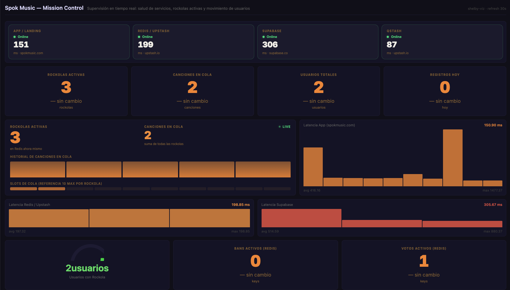

# Mission Control

A monitoring dashboard for a small SaaS product: service health, an active-jukebox
queue backed by Redis, and user growth. Built end-to-end — pipelines, Python
scripts, and custom widgets — by pointing Claude Code at this repo's
[`llms.txt`](../../llms.txt) and describing the goal in plain English. No part
of the YAML or the Jinja2 templates below was hand-written first and cleaned up
after; this is what the agent produced from the spec.



This is a genericized version of a real production dashboard — service names
and business-specific detail have been swapped for placeholders, but the
pipelines, scripts, and widgets are unmodified.

## Try it without any credentials

```bash
shelby viz sandbox . --watch
# open http://localhost:5000
```

`sandbox.yml` ships mock data for all three pipelines, so the dashboard renders
fully without a running Shelby server or real API keys.

## Pipelines

| Pipeline | Interval | What it measures |
|---|---|---|
| `health` | 60s | Latency and status of the app, Redis, database, and queue |
| `queue`  | 120s | Active jukeboxes, songs queued, key distribution |
| `users`  | 300s | Total users, signups today, users with a jukebox configured |

## Required environment variables

To run this against a live backend instead of `sandbox.yml`, export:

```bash
# Upstash Redis
export KV_REST_API_URL="https://your-instance.upstash.io"
export KV_REST_API_TOKEN="..."

# Supabase (note: SUPABASE_URL, not the PUBLIC_-prefixed variant)
export SUPABASE_URL="https://your-project.supabase.co"
export SUPABASE_SERVICE_ROLE_KEY="..."

# QStash
export QSTASH_TOKEN="..."

# App
export APP_URL="https://your-app.example.com"
```

## Usage

### 1. Register the pipelines

```bash
shelby add pipelines/health.yml
shelby add pipelines/queue.yml
shelby add pipelines/users.yml
```

### 2. Validate

```bash
shelby validate pipelines/health.yml
shelby validate pipelines/queue.yml
shelby validate pipelines/users.yml
```

### 3. Run once, ad-hoc

```bash
shelby run health
shelby run queue
shelby run users
```

### 4. Start the Shelby server (scheduler + API)

```bash
shelby serve
# → http://localhost:8080
```

### 5. Start the dashboard

```bash
# Live mode (requires shelby serve running)
shelby viz serve . --watch

# Sandbox mode with mock data (no Shelby server required)
shelby viz sandbox . --watch
```

The dashboard is available at **http://localhost:5000**.

## Project layout

```
mission-control/
  pipelines/
    health.yml        # Service health checks (60s)
    queue.yml          # Redis scan (120s)
    users.yml          # Supabase user stats (300s)
    scripts/
      redis_scan.py     # Full Upstash Redis scan via REST API
      user_stats.py      # Paginated Supabase Auth Admin API
  widgets/
    health-strip.html.j2  # 4 services side by side with latency
    queue-pulse.html.j2    # Jukebox/queue visualization
    counter.html.j2         # Big-number override with trend arrow
  dashboard.yml            # Widget layout and bindings
  sandbox.yml              # Mock data for offline development
  screenshot.png
```

## Widgets

| Widget | Type | Data |
|---|---|---|
| Service Status | custom | Latency + status for all 4 services |
| Active Jukeboxes | counter | `scan.active_playlists` |
| Songs Queued | counter | `scan.total_songs` |
| Total Users | counter | `users.total_users` |
| Signups Today | counter | `users.new_today` |
| Jukeboxes & Queue | custom | Sparkline of queued songs + slot visualization |
| App Latency | timeseries | `app_ping.response_time` |
| Redis Latency | timeseries | `redis_ping.response_time` |
| Supabase Latency | timeseries | `supabase_ping.response_time` |
| Users With Jukebox | gauge | `users.with_jukebox` |
| Active Bans | counter | `scan.key_bans` |
| Active Votes | counter | `scan.key_votes` |
| Signup history | table | `users.new_today` (last 20 runs) |
| Queue history | table | `scan.total_songs` (last 20 runs) |
